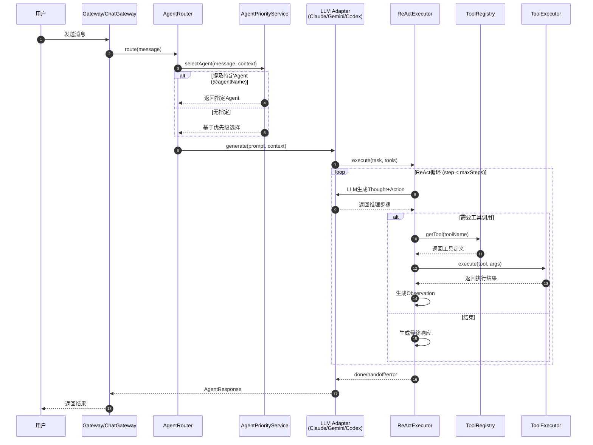

```mermaid
sequenceDiagram
    autonumber
    participant User as 用户
    participant Gateway as Gateway/ChatGateway
    participant Router as AgentRouter
    participant Priority as AgentPriorityService
    participant Adapter as LLM Adapter<br/>(Claude/Gemini/Codex)
    participant ReAct as ReActExecutor
    participant Registry as ToolRegistry
    participant Tool as ToolExecutor
    User->>Gateway: 发送消息
    Gateway->>Router: route(message)
    Router->>Priority: selectAgent(message, context)

    alt 提及特定Agent (@agentName)
        Priority-->>Router: 返回指定Agent
    else 无指定
        Priority-->>Router: 基于优先级选择
    end

    Router->>Adapter: generate(prompt, context)
    Adapter->>ReAct: execute(task, tools)

    loop ReAct循环 (step < maxSteps)
        ReAct->>Adapter: LLM生成Thought+Action
        Adapter-->>ReAct: 返回推理步骤

        alt 需要工具调用
            ReAct->>Registry: getTool(toolName)
            Registry-->>ReAct: 返回工具定义
            ReAct->>Tool: execute(tool, args)
            Tool-->>ReAct: 返回执行结果
            ReAct->>ReAct: 生成Observation
        else 结束
            ReAct->>ReAct: 生成最终响应
        end
    end

    ReAct-->>Adapter: done/handoff/error
    Adapter-->>Gateway: AgentResponse
    Gateway-->>User: 返回结果

```
