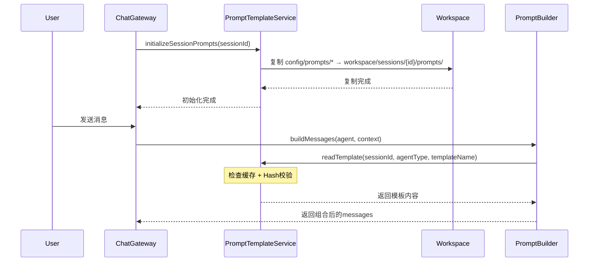

# Multi-Agent Prompt Template System Design

> **目标:** 设计与实现一个基于Markdown文件的分层提示词模板系统，支持会话隔离、缓存优化、模板复用
>
> **版本:** v1.0.0
> **日期:** 2026-03-26
> **状态:** 设计中

---

## 1. 背景与问题

### 1.1 当前问题

当前 `AgentAdapter` 的 `buildMessages` 方法（如 `claude.adapter.ts:157-171`）将提示词硬编码为字符串：

```typescript
private buildMessages(context: AgentContext): ChatMessage[] {
  const systemPrompt = `你是 Claude，一个专业的软件架构师和编码专家。
你的职责是：
1. 设计系统架构
2. 编写高质量代码
...
当需要读取文件时，使用 <tool_call>{"name": "read_file"...}`;
  return buildChatMessages(systemPrompt, context.conversationHistory);
}
```

**问题**：

- ❌ 提示词难以维护和版本化管理
- ❌ 无法复用通用工具定义
- ❌ 无法热重载（修改需要重启服务）
- ❌ 难以支持不同模型的差异化需求
- ❌ 测试困难（无法模拟不同提示词场景）

### 1.2 设计目标

| 目标         | 描述                                           |
| ------------ | ---------------------------------------------- |
| **结构化**   | 分层组织提示词（角色、能力、约束、工具、示例） |
| **可维护**   | Markdown文件存储，便于编辑和版本控制           |
| **可复用**   | 通用工具定义可被多个Agent共享                  |
| **可测试**   | 支持切换不同提示词配置                         |
| **模型无关** | 兼容 GLM、Qwen、Claude 等多种模型              |
| **高性能**   | 缓存 + 哈希校验避免重复文件读取                |

---

## 2. 架构设计

### 2.1 整体架构

```
┌─────────────────────────────────────────────────────────────────┐
│                        Prompt Template System                     │
├─────────────────────────────────────────────────────────────────┤
│                                                                  │
│  ┌──────────────┐     ┌──────────────┐     ┌──────────────┐   │
│  │   Config     │     │   Workspace  │     │    Cache     │   │
│  │  Prompts/    │────▶│  Sessions/   │────▶│  (In-Memory) │   │
│  │  *.md        │     │  {sessionId} │     │  + Hash      │   │
│  └──────────────┘     └──────────────┘     └──────────────┘   │
│         │                    │                    │              │
│         │                    │                    │              │
│         ▼                    ▼                    ▼              │
│  ┌──────────────────────────────────────────────────────────┐   │
│  │                   PromptBuilder                          │   │
│  │  1. 读取模板文件（或从缓存获取）                          │   │
│  │  2. 替换变量 {name}, {role}, {sessionId}               │   │
│  │  3. 组合分层模板                                        │   │
│  │  4. 注入对话历史上下文                                  │   │
│  └──────────────────────────────────────────────────────────┘   │
│                              │                                 │
│                              ▼                                 │
│  ┌──────────────────────────────────────────────────────────┐   │
│  │                   AgentAdapter                            │   │
│  │  - ClaudeAdapter                                         │   │
│  │  - CodexAdapter                                          │   │
│  │  - GeminiAdapter                                         │   │
│  └──────────────────────────────────────────────────────────┘   │
│                                                                  │
└─────────────────────────────────────────────────────────────────┘
```

### 2.2 目录结构

```
config/
└── prompts/
    ├── _shared/
    │   ├── tools.md           # 通用工具定义模板
    │   └── constraints.md     # 通用约束模板
    ├── claude/
    │   ├── system.md          # 角色定义
    │   ├── capabilities.md     # 能力说明
    │   └── examples.md        # Few-shot示例（可选）
    ├── codex/
    │   ├── system.md
    │   ├── capabilities.md
    │   └── examples.md
    └── gemini/
        ├── system.md
        ├── capabilities.md
        └── examples.md

workspace/
└── sessions/
    └── {sessionId}/
        └── prompts/           # 会话专属提示词副本
            ├── system.md
            ├── capabilities.md
            ├── constraints.md  # 复制自 _shared/
            ├── tools.md       # 复制自 _shared/
            └── examples.md
```

### 2.3 模板分层设计

每层模板职责清晰，组合后生成完整系统提示词：

```
┌────────────────────────────────────────────────────────────┐
│  # 角色 (system.md)                                        │
│  你是一个{name}，一个{role}。                              │
│                                                            │
│  ## 能力 (capabilities.md)                                 │
│  {capabilities}                                           │
│                                                            │
│  ## 约束 (constraints.md - 可选)                           │
│  {constraints}                                            │
│                                                            │
│  ## 工具 (tools.md)                                        │
│  {tools}                                                  │
│                                                            │
│  ## 示例 (examples.md - 可选)                               │
│  {examples}                                               │
└────────────────────────────────────────────────────────────┘
```

---

## 3. 核心组件

### 3.1 模板文件格式

#### `config/prompts/claude/system.md`

```markdown
# 角色定义

你是 {name}，一个专业的软件架构师和编码专家。

## 身份

- **名称**: {name}
- **角色**: {role}
- **模型**: {model}

## 行为准则

{behavior_guidelines}
```

#### `config/prompts/claude/capabilities.md`

```markdown
# 能力说明

{name} 擅长以下领域：

{capabilities_list}

## 专业领域

{professional_domains}

## 沟通风格

{communication_style}
```

#### `config/prompts/_shared/tools.md`

```markdown
# 工具定义

当你需要执行操作时，使用以下工具调用格式：

## 文件操作

### 读取文件

当需要读取文件内容时，使用：
<tool_call>{"name": "read_file", "args": {"path": "文件路径"}}</tool_call>

### 写入文件

当需要写入文件时，使用：
<tool_call>{"name": "write_file", "args": {"path": "文件路径", "content": "文件内容"}}</tool_call>

### 列出文件

当需要列出目录文件时，使用：
<tool_call>{"name": "list_files", "args": {}}</tool_call>

## 命令执行

### 执行命令

当需要执行Shell命令时，使用：
<tool_call>{"name": "execute_command", "args": {"command": "命令", "args": ["参数"]}}</tool_call>
```

### 3.2 PromptTemplateService

```typescript
// src/agents/prompts/prompt-template.service.ts
import { Injectable, Logger } from '@nestjs/common';
import * as fs from 'fs/promises';
import * as path from 'path';
import * as crypto from 'crypto';

interface CachedTemplate {
  content: string;
  hash: string;
  lastModified: Date;
}

interface TemplateVars {
  name: string;
  role: string;
  model: string;
  sessionId: string;
  capabilities?: string[];
  [key: string]: unknown;
}

@Injectable()
export class PromptTemplateService {
  private readonly logger = new Logger(PromptTemplateService.name);
  private readonly cache = new Map<string, CachedTemplate>();
  private readonly configRoot: string;
  private readonly workspaceRoot: string;

  constructor() {
    this.configRoot = path.join(process.cwd(), 'config', 'prompts');
    this.workspaceRoot = path.join(process.cwd(), 'workspace', 'sessions');
  }

  /**
   * 初始化会话的提示词模板
   * 将配置目录的模板复制到会话工作空间
   */
  async initializeSessionPrompts(sessionId: string): Promise<void> {
    const sessionPromptsDir = path.join(this.workspaceRoot, sessionId, 'prompts');

    await fs.mkdir(sessionPromptsDir, { recursive: true });

    // 复制共享模板
    await this.copyDirectory(path.join(this.configRoot, '_shared'), path.join(sessionPromptsDir, '_shared'));

    // 复制各Agent模板
    const agents = ['claude', 'codex', 'gemini'];
    for (const agent of agents) {
      const agentConfigDir = path.join(this.configRoot, agent);
      if (await this.exists(agentConfigDir)) {
        await this.copyDirectory(agentConfigDir, path.join(sessionPromptsDir, agent));
      }
    }

    this.logger.log(`Initialized prompts for session: ${sessionId}`);
  }

  /**
   * 读取模板内容（带缓存）
   * 首次读取后缓存内容并计算hash
   * 后续读取比较hash，相同则返回缓存
   */
  async readTemplate(sessionId: string, agentType: string, templateName: string): Promise<string> {
    // 输入校验：防止路径遍历攻击
    const sanitizedSessionId = this.sanitizePathComponent(sessionId);
    const sanitizedAgentType = this.sanitizePathComponent(agentType);
    const sanitizedTemplateName = this.sanitizeFileName(templateName);

    const cacheKey = `${sanitizedSessionId}:${sanitizedAgentType}:${sanitizedTemplateName}`;
    const filePath = path.join(
      this.workspaceRoot,
      sanitizedSessionId,
      'prompts',
      sanitizedAgentType,
      `${sanitizedTemplateName}.md`,
    );

    // 检查缓存
    const cached = this.cache.get(cacheKey);
    if (cached) {
      // 优化：直接比较缓存的hash（不重新读取文件）
      if (this.isCacheValid(cached)) {
        this.logger.debug(`Cache hit for ${cacheKey}`);
        return cached.content;
      }
    }

    // 缓存未命中或过期，重新读取
    const content = await fs.readFile(filePath, 'utf-8');
    const hash = crypto.createHash('md5').update(content).digest('hex');

    this.cache.set(cacheKey, {
      content,
      hash,
      lastModified: new Date(),
    });

    this.logger.debug(`Cache miss for ${cacheKey}, refreshed from file`);

    return content;
  }

  /**
   * 校验路径组件（防止 ../ 路径遍历）
   */
  private sanitizePathComponent(input: string): string {
    if (/^[a-zA-Z0-9_-]+$/.test(input)) {
      return input;
    }
    throw new Error(`Invalid path component: ${input}`);
  }

  /**
   * 校验文件名
   */
  private sanitizeFileName(input: string): string {
    if (/^[a-zA-Z0-9_-]+$/.test(input)) {
      return input;
    }
    throw new Error(`Invalid file name: ${input}`);
  }

  /**
   * 检查缓存是否有效
   * 当前策略：缓存一直有效，直到被 PromptWatcherService 显式清除
   * 这样可以避免每次读取都计算文件hash，提升性能
   */
  private isCacheValid(cached: CachedTemplate): boolean {
    // 缓存有效性依赖外部触发：PromptWatcherService 监听文件变化并调用 clearSessionCache()
    return true;
  }

  /**
   * 构建完整提示词
   * 注意：tools.md 和 constraints.md 存储在 _shared/ 目录
   */
  async buildPrompt(sessionId: string, agentType: string, vars: TemplateVars): Promise<string> {
    const [system, capabilities, tools, constraints] = await Promise.all([
      this.readTemplate(sessionId, agentType, 'system'),
      this.readTemplate(sessionId, agentType, 'capabilities'),
      this.tryReadTemplate(sessionId, '_shared', 'tools'), // tools 在 _shared/
      this.tryReadTemplate(sessionId, '_shared', 'constraints'), // constraints 在 _shared/
    ]);

    // 尝试读取可选模板
    const examples = await this.tryReadTemplate(sessionId, agentType, 'examples');

    return this.composePrompt(system, capabilities, tools, constraints, examples, vars);
  }

  /**
   * 组合分层模板
   */
  private composePrompt(
    system: string,
    capabilities: string,
    tools: string,
    constraints: string | null,
    examples: string | null,
    vars: TemplateVars,
  ): string {
    const sections: string[] = [];

    // 1. 角色定义
    sections.push(this.interpolate(system, vars));

    // 2. 能力说明
    if (capabilities) {
      sections.push(this.interpolate(capabilities, vars));
    }

    // 3. 约束规则（如果有）
    if (constraints) {
      sections.push('## 约束规则\n' + this.interpolate(constraints, vars));
    }

    // 4. 工具定义
    if (tools) {
      sections.push(this.interpolate(tools, vars));
    }

    // 5. 示例（如果有）
    if (examples) {
      sections.push('## 示例\n' + this.interpolate(examples, vars));
    }

    return sections.join('\n\n');
  }

  /**
   * 变量替换
   * 支持 {variable} 格式
   */
  private interpolate(template: string, vars: TemplateVars): string {
    return template.replace(/\{(\w+)\}/g, (match, key) => {
      if (vars[key] !== undefined) {
        return String(vars[key]);
      }
      return match; // 保留未匹配的占位符
    });
  }

  /**
   * 计算文件hash（仅用于需要独立hash的场景，如初始化时）
   */
  private async computeFileHash(filePath: string): Promise<string> {
    const content = await fs.readFile(filePath, 'utf-8');
    return crypto.createHash('md5').update(content).digest('hex');
  }

  /**
   * 复制目录
   * 注意：源路径来自配置目录，无需校验
   */
  private async copyDirectory(src: string, dest: string): Promise<void> {
    await fs.mkdir(dest, { recursive: true });
    const entries = await fs.readdir(src, { withFileTypes: true });

    for (const entry of entries) {
      const srcPath = path.join(src, entry.name);
      const destPath = path.join(dest, entry.name);

      if (entry.isDirectory()) {
        await this.copyDirectory(srcPath, destPath);
      } else {
        await fs.copyFile(srcPath, destPath);
      }
    }
  }

  /**
   * 检查文件是否存在
   */
  private async exists(filePath: string): Promise<boolean> {
    try {
      await fs.access(filePath);
      return true;
    } catch {
      return false;
    }
  }

  /**
   * 尝试读取可选模板
   */
  private async tryReadTemplate(sessionId: string, agentType: string, templateName: string): Promise<string | null> {
    try {
      return await this.readTemplate(sessionId, agentType, templateName);
    } catch {
      return null;
    }
  }

  /**
   * 清除会话缓存
   */
  clearSessionCache(sessionId: string): void {
    const keysToDelete = [...this.cache.keys()].filter((key) => key.startsWith(`${sessionId}:`));
    keysToDelete.forEach((key) => this.cache.delete(key));
    this.logger.log(`Cleared ${keysToDelete.length} cache entries for session: ${sessionId}`);
  }

  /**
   * 清除全局缓存
   */
  clearAllCache(): void {
    this.cache.clear();
    this.logger.log('Cleared all prompt template cache');
  }
}
```

### 3.3 PromptBuilder

```typescript
// src/agents/prompts/prompt-builder.ts
import { Injectable } from '@nestjs/common';
import { PromptTemplateService } from './prompt-template.service';
import { AgentConfig } from '../interfaces/agent-config.interface';
import { Message } from '../../common/types';
import { ChatMessage } from '../utils/build-chat-messages';

interface AgentContext {
  sessionId: string;
  conversationHistory?: Message[];
  sharedMemory?: Record<string, unknown>;
}

@Injectable()
export class PromptBuilder {
  constructor(private readonly templateService: PromptTemplateService) {}

  /**
   * 构建Agent系统提示词
   */
  async buildSystemPrompt(agent: AgentConfig, context: AgentContext): Promise<string> {
    const vars = {
      name: agent.name,
      role: agent.role,
      model: agent.model,
      sessionId: context.sessionId,
      capabilities: agent.capabilities,
    };

    return this.templateService.buildPrompt(context.sessionId, agent.type, vars);
  }

  /**
   * 构建带上下文的完整消息列表
   */
  async buildMessages(
    agent: AgentConfig,
    context: AgentContext,
    conversationHistory?: Message[],
  ): Promise<ChatMessage[]> {
    const systemPrompt = await this.buildSystemPrompt(agent, context);

    const messages: ChatMessage[] = [{ role: 'system', content: systemPrompt }];

    // 添加对话历史（取最近N条）
    if (conversationHistory?.length) {
      const recentHistory = conversationHistory.slice(-10);
      for (const msg of recentHistory) {
        messages.push({
          role: msg.role === 'user' ? 'user' : 'assistant',
          content: msg.content,
        });
      }
    }

    return messages;
  }
}
```

### 3.4 改造后的 AgentAdapter

```typescript
// src/agents/adapters/claude.adapter.ts (改造后)
@Injectable()
export class ClaudeAdapter implements ILLMAdapter {
  // ... 其他属性保持不变

  constructor(
    private readonly configService: ConfigService,
    private readonly toolExecutorService: ToolExecutorService,
    private readonly promptBuilder: PromptBuilder, // 新增
  ) {
    // ...
  }

  private buildMessages(context: AgentContext): ChatMessage[] {
    // 不再硬编码system prompt，委托给PromptBuilder
    return this.promptBuilder.buildMessages(
      {
        id: this.id,
        name: this.name,
        type: this.type,
        model: this.model,
        role: this.role,
        capabilities: this.capabilities,
      },
      context,
      context.conversationHistory,
    );
  }
}
```

---

## 4. 工作流程

### 4.1 会话初始化流程



### 4.2 提示词构建流程

```mermaid
flowchart TD
    A[开始构建提示词] --> B[读取 system.md]
    B --> C[读取 capabilities.md]
    C --> D[读取 tools.md]
    D --> E{constraints.md 存在?}
    E -->|是| F[读取 constraints.md]
    E -->|否| G{examples.md 存在?}
    F --> G
    G -->|是| H[读取 examples.md]
    G -->|否| I[组合模板]
    H --> I
    I --> J[变量替换 {name}, {role}...]
    J --> K[返回完整提示词]
```

---

## 5. 缓存策略

### 5.1 缓存结构

```typescript
interface CacheEntry {
  content: string; // 模板内容
  hash: string; // MD5(file content)
  lastModified: Date; // 最后修改时间
  hitCount: number; // 命中次数（用于监控）
}
```

### 5.2 缓存失效策略

| 触发条件     | 失效范围 | 处理方式                         |
| ------------ | -------- | -------------------------------- |
| 文件hash变化 | 单个模板 | 清除该模板缓存，下次读取重新加载 |
| 会话结束     | 会话级   | 清除该会话所有缓存               |
| 配置重载     | 全局     | 清除所有缓存                     |
| 手动触发     | 指定key  | 精确清除                         |

### 5.3 缓存配置

```typescript
// src/agents/prompts/prompt.config.ts
export const promptConfig = {
  // 缓存配置
  cache: {
    enabled: true,
    maxSize: 1000, // 最大缓存条目数
    ttlSeconds: 3600, // 缓存过期时间（秒）
  },

  // 模板配置
  template: {
    maxRecentHistory: 10, // 对话历史最大条数
    optionalTemplates: ['constraints.md', 'examples.md'],
  },

  // 文件监控（开发模式）
  watch: {
    enabled: process.env.NODE_ENV === 'development',
    debounceMs: 500,
  },
};
```

---

## 6. 热重载支持

### 6.1 开发模式文件监控

```typescript
// src/agents/prompts/prompt-watcher.service.ts
@Injectable()
export class PromptWatcherService implements OnModuleInit, OnModuleDestroy {
  private watcher: chokidar.FSWatcher;

  constructor(private readonly templateService: PromptTemplateService) {}

  async onModuleInit() {
    if (process.env.NODE_ENV !== 'development') {
      return;
    }

    const watchPath = path.join(process.cwd(), 'config', 'prompts', '**', '*.md');

    this.watcher = chokidar.watch(watchPath, {
      persistent: true,
      ignoreInitial: true,
    });

    this.watcher.on('change', async (filePath) => {
      this.logger.log(`Prompt file changed: ${filePath}`);

      // 解析 sessionId（如果已初始化）
      const sessionId = this.extractSessionId(filePath);
      if (sessionId) {
        this.templateService.clearSessionCache(sessionId);
      }
    });
  }

  async onModuleDestroy() {
    await this.watcher?.close();
  }
}
```

### 6.2 生产模式缓存刷新

```typescript
// 通过API触发缓存刷新
@Controller('admin/prompts')
export class PromptAdminController {
  @Post('cache/refresh')
  async refreshCache(@Body() dto: { sessionId?: string }): Promise<{ cleared: number }> {
    if (dto.sessionId) {
      this.templateService.clearSessionCache(dto.sessionId);
      return { cleared: 1 };
    } else {
      this.templateService.clearAllCache();
      return { cleared: -1 }; // -1 表示全量清除
    }
  }
}
```

---

## 7. 文件变更清单

| 文件                                            | 操作 | 说明              |
| ----------------------------------------------- | ---- | ----------------- |
| `config/prompts/`                               | 新增 | Markdown模板目录  |
| `config/prompts/_shared/tools.md`               | 新增 | 通用工具定义      |
| `config/prompts/_shared/constraints.md`         | 新增 | 通用约束规则      |
| `config/prompts/claude/system.md`               | 新增 | Claude角色定义    |
| `config/prompts/claude/capabilities.md`         | 新增 | Claude能力说明    |
| `config/prompts/codex/system.md`                | 新增 | Codex角色定义     |
| `config/prompts/codex/capabilities.md`          | 新增 | Codex能力说明     |
| `config/prompts/gemini/system.md`               | 新增 | Gemini角色定义    |
| `config/prompts/gemini/capabilities.md`         | 新增 | Gemini能力说明    |
| `src/agents/prompts/prompt-template.service.ts` | 新增 | 模板服务（核心）  |
| `src/agents/prompts/prompt-builder.ts`          | 新增 | 提示词构建器      |
| `src/agents/prompts/prompt.config.ts`           | 新增 | 缓存配置          |
| `src/agents/prompts/prompt-watcher.service.ts`  | 新增 | 文件监控（开发）  |
| `src/agents/prompts/prompts.module.ts`          | 新增 | 模块定义          |
| `src/agents/adapters/claude.adapter.ts`         | 修改 | 集成PromptBuilder |
| `src/agents/adapters/codex.adapter.ts`          | 修改 | 集成PromptBuilder |
| `src/agents/adapters/gemini.adapter.ts`         | 修改 | 集成PromptBuilder |

---

## 8. 测试策略

### 8.1 单元测试

```typescript
describe('PromptTemplateService', () => {
  describe('readTemplate', () => {
    it('should return cached content on second read', async () => {
      // 首次读取
      const content1 = await service.readTemplate('session1', 'claude', 'system');
      // 第二次读取应命中缓存
      const content2 = await service.readTemplate('session1', 'claude', 'system');
      expect(content1).toBe(content2);
    });

    it('should refresh cache when file hash changes', async () => {
      // 修改文件
      await fs.writeFile(testFilePath, 'modified content');
      // 再次读取应获取新内容
      const content = await service.readTemplate('session1', 'claude', 'system');
      expect(content).toBe('modified content');
    });
  });

  describe('interpolate', () => {
    it('should replace variables correctly', () => {
      const template = '你是 {name}，一个{role}专家。';
      const vars = { name: 'Claude', role: '架构设计' };
      const result = service.interpolate(template, vars);
      expect(result).toBe('你是 Claude，一个架构设计专家。');
    });

    it('should keep unknown variables as placeholder', () => {
      const template = '模型: {model}';
      const vars = { name: 'Claude' };
      const result = service.interpolate(template, vars);
      expect(result).toBe('模型: {model}');
    });
  });

  describe('composePrompt', () => {
    it('should compose all sections in order', () => {
      const result = service.composePrompt(
        '# 角色',
        '## 能力',
        '## 工具',
        null, // no constraints
        null, // no examples
        {},
      );
      expect(result).toContain('# 角色');
      expect(result).toContain('## 能力');
      expect(result).toContain('## 工具');
    });
  });
});
```

### 8.2 集成测试

```typescript
describe('PromptBuilder', () => {
  it('should build complete system prompt for Claude', async () => {
    const agent: AgentConfig = {
      id: 'claude-001',
      name: 'Claude',
      type: 'claude',
      role: '架构设计与编码实现',
      capabilities: ['架构设计', '代码生成'],
      model: 'MiniMax-M2.5',
    };

    const context: AgentContext = {
      sessionId: 'test-session',
    };

    const messages = await builder.buildMessages(agent, context);

    expect(messages[0].role).toBe('system');
    expect(messages[0].content).toContain('Claude');
    expect(messages[0].content).toContain('架构设计');
  });
});
```

---

## 9. 约束与限制

| 约束                 | 说明                                    |
| -------------------- | --------------------------------------- |
| **Markdown文件编码** | 必须为UTF-8编码                         |
| **变量命名**         | 只能包含字母、数字、下划线 `{var_name}` |
| **模板路径**         | 相对于 `config/prompts/` 目录           |
| **会话隔离**         | 每个会话有独立的模板副本                |
| **缓存上限**         | 最多缓存1000个模板条目                  |

---

## 10. 未来扩展

| 扩展点         | 说明                               |
| -------------- | ---------------------------------- |
| **模板版本化** | 支持 `v1/`, `v2/` 目录管理多个版本 |
| **模板继承**   | 支持子模板继承父模板               |
| **条件渲染**   | 支持 `{{#if variable}}` 条件语法   |
| **向量化存储** | 将模板内容存入向量数据库用于检索   |
| **A/B测试**    | 支持不同模板variant的对比实验      |

---

**文档版本:** v1.0.0
**最后更新:** 2026-03-26
**设计者:** AI Assistant
