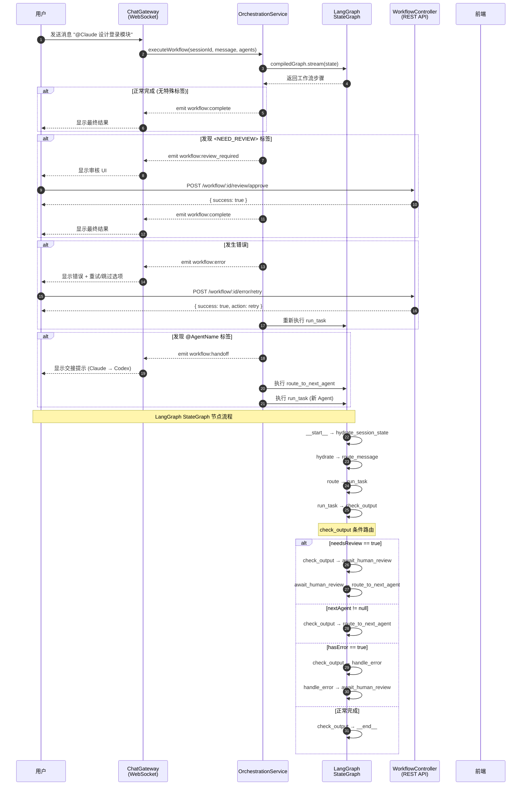
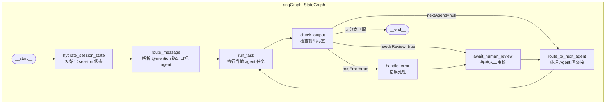

# LangGraph Workflow 重新实现设计

> **Date:** 2026-03-27
> **Goal:** 重新引入 LangGraph StateGraph，实现多 Agent 串行协作，支持 Human-in-the-loop、Error Recovery、Agent Handoff 三种条件分支

## 背景

原计划 (2026-03-24) 要求使用 LangGraph StateGraph 实现多 Agent 协作，但实际实现中：

- `workflow.graph.ts` 仅包含常量定义，未使用 `StateGraph`
- `orchestration.service.ts` 使用简单的 `while` 循环代替了 LangGraph 的条件边机制

本次设计修正这一偏离，重新实现完整的 LangGraph 工作流。

---

## Architecture

### LangGraph StateGraph 定义

```
Nodes:
├── hydrate_session_state   # 初始化 session 状态
├── route_message           # 解析 @mention 确定目标 agent
├── run_task               # 执行当前 agent 任务
├── check_output           # 检查输出：<NEED_REVIEW> / @handoff / error
├── await_human_review     # 暂停等待人工审核
├── route_to_next_agent    # 处理 Agent 间 handoff
└── handle_error           # 错误处理

Edges:
__start__
   ↓
hydrate_session_state
   ↓
route_message
   ↓
run_task
   ↓
check_output
   ├── 发现 <NEED_REVIEW>  ──→ await_human_review
   ├── 发现 @Agent          ──→ route_to_next_agent → run_task
   ├── 发生错误             ──→ handle_error
   │                                  ↓
   │                         await_human_review (重试决策)
   └── 正常完成             ──→ __end__
```

### 条件边实现

```typescript
// check_output 后的条件路由
const checkOutputRouter = (state: WorkflowState): string => {
  if (state.hasError) return 'handle_error';
  if (state.needsReview) return 'await_human_review';
  if (state.nextAgent) return 'route_to_next_agent';
  return '__end__';
};

// handle_error 后的决策
const errorRouter = (state: WorkflowState): string => {
  return 'await_human_review'; // 统一到人工决策点
};
```

---

## Components

### 1. WorkflowState 扩展

```typescript
interface WorkflowState {
  sessionId: string;
  messages: Message[];
  pendingTasks: Task[];
  completedTasks: Task[];
  currentAgent: string | null;
  nextAgent: string | null;
  isComplete: boolean;
  chainOfThought: string[];

  // 新增字段
  hasError: boolean;
  errorMessage?: string;
  needsReview: boolean;
  reviewReason?: string;
  lastOutput?: string;
  metadata: Record<string, unknown>;
}
```

### 2. Output Parser (新增)

解析 Agent 输出，提取：

- `<NEED_REVIEW>` 标签 → 设置 `needsReview = true`
- `@AgentName` → 设置 `nextAgent = AgentName`
- 错误标记 → 设置 `hasError = true`

```typescript
// src/orchestration/handoff/output-parser.ts
export function parseAgentOutput(output: string): {
  needsReview: boolean;
  nextAgent: string | null;
  hasError: boolean;
  cleanOutput: string;
} {
  const needsReview = /<NEED_REVIEW>/i.test(output);
  const handoffMatch = output.match(/@(\w+)/);
  const nextAgent = handoffMatch ? handoffMatch[1] : null;
  const cleanOutput = output
    .replace(/<NEED_REVIEW>/gi, '')
    .replace(/<reasoning>[\s\S]*?<\/reasoning>/gi, '')
    .trim();

  return { needsReview, nextAgent, hasError: false, cleanOutput };
}
```

### 3. OrchestrationService 重构

```typescript
@Injectable()
export class OrchestrationService {
  private compiledGraph: CompiledGraph;

  constructor(
    private readonly agentRouter: AgentRouter,
    private readonly cotWriter: CotWriterService,
    private readonly planner: PlannerService,
    private readonly reactor: ReactorService,
  ) {
    this.compiledGraph = buildWorkflowGraph();
  }

  async *streamExecute(
    sessionId: string,
    userMessage: string,
    mentionedAgents: string[],
  ): AsyncGenerator<WorkflowEvent> {
    let state = this.createInitialState(sessionId, userMessage, mentionedAgents);

    for await (const step of this.compiledGraph.stream(state)) {
      state = step;
      yield this.stateToEvent(state);
    }
  }

  // 供外部调用的同步版本
  async executeWorkflow(sessionId: string, userMessage: string, mentionedAgents: string[]): Promise<void> {
    for await (const _ of this.streamExecute(sessionId, userMessage, mentionedAgents)) {
      // consume stream
    }
  }
}

type WorkflowEvent =
  | { type: 'task_start'; agentName: string; task: string }
  | { type: 'task_complete'; output: string }
  | { type: 'needs_review'; reason: string }
  | { type: 'needs_decision'; error?: string }
  | { type: 'handoff'; from: string; to: string }
  | { type: 'complete'; finalOutput: string };
```

### 4. ReviewController (新增)

提供 Human-in-the-loop 决策 API：

```typescript
@Controller('workflow')
export class WorkflowController {
  @Post(':sessionId/review/approve')
  approveReview(@Param('sessionId') sessionId: string): void;

  @Post(':sessionId/review/reject')
  rejectReview(@Param('sessionId') sessionId, @Body() dto: { reason?: string }): void;

  @Post(':sessionId/error/retry')
  retryTask(@Param('sessionId') sessionId): void;

  @Post(':sessionId/error/skip')
  skipTask(@Param('sessionId') sessionId): void;
}
```

### 5. WebSocket 事件 (扩展 ChatGateway)

```typescript
// 新增事件类型
type WorkflowEvent =
  | { event: 'workflow:review_required'; sessionId: string; reason: string; output: string }
  | { event: 'workflow:error'; sessionId: string; error: string; task: string }
  | { event: 'workflow:handoff'; sessionId: string; from: string; to: string }
  | { event: 'workflow:complete'; sessionId: string; output: string };
```

---

## Data Flow

### Human-in-the-loop 流程

```
1. User → ChatGateway: "@Claude 设计登录模块"
2. ChatGateway → OrchestrationService: streamExecute(...)
3. OrchestrationService → compiledGraph.stream(state)
4. Graph: route_message → run_task (Claude 生成设计文档)
5. Graph: check_output 发现 <NEED_REVIEW>
6. OrchestrationService 发出: { type: 'needs_review', reason: '设计文档待审核' }
7. ChatGateway WebSocket → 前端: workflow:review_required
8. 前端显示审核 UI
9. User 点击"批准"
10. POST /workflow/:sessionId/review/approve
11. OrchestrationService 继续 stream
12. Graph: await_human_review → route_to_next_agent
```

### Error Recovery 流程

```
1. run_task 执行时 API 超时 → 抛出异常
2. Graph: check_output 检测 hasError=true
3. OrchestrationService 发出: { type: 'needs_decision', error: 'API 超时' }
4. ChatGateway WebSocket → 前端: workflow:error
5. 前端显示重试/跳过选项
6. User 选择"重试"
7. POST /workflow/:sessionId/error/retry
8. Graph: handle_error → run_task (重新执行)
```

---

## ChatGateway 接入点

**现状问题：** `OrchestrationService` 存在但从未被调用。`handleMessage` 直接循环 `routeResult.targetAgents` 调用 `handleAgentResponse`，完全绕过了 OrchestrationService。

**改造方案：** 在 `handleMessage` 中，将现有的 for 循环替换为 OrchestrationService 调用：

```typescript
// 现有代码 (handleMessage, line 176-178):
for (const agent of routeResult.targetAgents) {
  await this.handleAgentResponse(sessionId, agent);
}

// 替换为:
await this.orchestrationService.executeWorkflow(sessionId, routeResult.processedContent, parsed.mentionedAgents);
```

**ChatGateway 修改要点：**

1. 注入 `OrchestrationService`
2. 将 `for (const agent of routeResult.targetAgents) ...` 替换为 `orchestrationService.executeWorkflow(...)`
3. `streamExecute` 产出的 `WorkflowEvent` 通过 WebSocket 转发给前端
4. 前端 HTTP POST 审批结果 → `WorkflowController` 处理

**注意：** 原来的 `handleAgentResponse` 方法可保留用于非 workflow 场景（如简单的单 agent 请求）。

---

## File Structure

```
src/orchestration/
├── orchestration.module.ts              # 修改：注入 OrchestrationService
├── orchestration.service.ts             # 重写：使用 compiledGraph
├── state/
│   └── workflow.state.ts               # 扩展：新增 hasError, needsReview 等
├── graph/
│   └── workflow.graph.ts               # 重写：完整的 StateGraph 定义
├── agents/
│   ├── planner.service.ts              # 保留
│   └── reactor.service.ts              # 保留
├── chain-of-thought/
│   └── cot-writer.service.ts          # 保留
├── handoff/
│   ├── mention-parser.ts               # 保留
│   └── output-parser.ts               # 新增：解析 Agent 输出
└── review/
    └── workflow-events.ts             # 新增：事件类型定义

src/gateway/
├── chat.gateway.ts                    # 修改：注入并调用 OrchestrationService
└── gateway.module.ts                  # 修改：导入 OrchestrationModule

src/workspace/
└── services/
    └── workspace.service.ts            # 修改：新增 workflow event log
```

---

## Testing Strategy

1. **单元测试**
   - `output-parser.spec.ts` - 测试标签提取逻辑
   - `workflow.graph.spec.ts` - 测试状态转换

2. **集成测试**
   - `orchestration.service.spec.ts` - 测试完整流程

3. **E2E 测试**
   - WebSocket 触发 workflow → 验证各分支

---

## Dependencies

- `@langchain/langgraph` (已安装)
- 无新增依赖

---

## Status

- [x] Task 1: 重写 `workflow.state.ts` - 新增 hasError, needsReview 等字段
- [x] Task 2: 创建 `output-parser.ts` - 解析 `<NEED_REVIEW>` 和 `@Agent`
- [x] Task 3: 重写 `workflow.graph.ts` - 完整的 LangGraph StateGraph 定义
- [x] Task 4: 重写 `orchestration.service.ts` - 使用 `compiledGraph.stream()`
- [x] Task 5: 创建 `workflow.controller.ts` - Human review API (approve/reject/retry/skip)
- [x] Task 6: 扩展 `chat.gateway.ts` - 注入 OrchestrationService，替换 `for (agent)` 循环
- [x] Task 7: 修改 `gateway.module.ts` - 导入 OrchestrationModule
- [x] Task 8: 运行测试
- [x] Task 9: Lint & Typecheck

---

## 实现时序图

### 完整交互时序图



### LangGraph StateGraph 节点图


