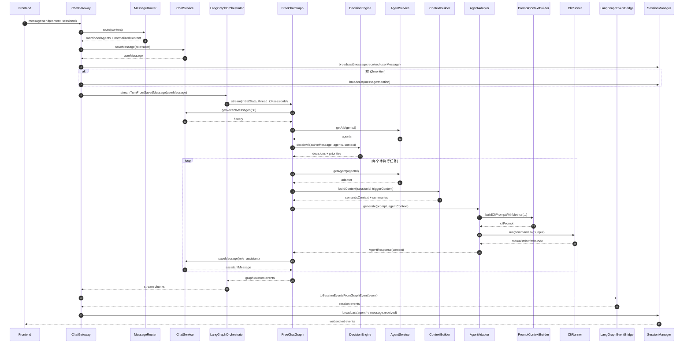

# 消息接收后到 CLI 执行的后端流程梳理（基于当前代码）

## 1. 范围与结论

本文聚焦 WebSocket 入口 `message:send`（以及 `message:retry`）后，后端如何完成：

1. 用户消息入库与广播
2. 多 Agent 决策与任务编排
3. 构建上下文并调用各 Agent 的 CLI
4. 结果回写与事件回推前端

当前实现的主链路是 **ChatGateway + LangGraph 编排**。  
在当前配置 `config/agents.config.json` 中，`claude-001/codex-001/gemini-001` 的 `callType` 均为 `cli`，因此实际走 `agent.generate(...)` + `CliRunnerService.run(...)`。

---

## 2. 核心组件与职责

### 2.1 入口与会话层

- `ChatGateway`
  - WebSocket 入口（`/chat`），处理 `message:send`、`message:retry`、`session:rename`
  - 负责参数校验、落消息、调用 LangGraph、广播事件
- `SessionManager`
  - 维护 session 与 socket 的映射
  - 提供 session 内广播能力
- `MessageRouter`
  - 解析 `@mention`
  - 输出 `mentionedAgents` 与规范化内容

### 2.2 消息存储与记忆层

- `ChatService`
  - 保存/读取消息
  - 用户消息与 Agent 消息都会经过它
  - 保存时附带副作用：
    - 写 transcript（`workspace/sessions/*/transcripts.jsonl`）
    - 写短期记忆（Redis）
    - 写向量（Chroma messages）
    - 触发自动摘要（ConversationSummaryService）
- `ShortTermMemoryService`（Redis）
  - session 窗口消息缓存（TTL + maxSize）
- `SharedMemoryService`（Redis）
  - `workspaceState`、`agent decision` 等共享状态
- `ConversationSummaryService`
  - 按阈值生成摘要并写回 `workspaceState`
  - 可写入 Chroma `summaries` 集合

### 2.3 编排与决策层（LangGraph）

- `LangGraphOrchestratorService`
  - 将用户消息包装成初始 `ChatGraphState`
  - 调用 `FreeChatGraphService.getGraph().stream(...)`
- `FreeChatGraphService`
  - 图节点：
    - `hydrate_session_state`：加载历史/共享状态
    - `route_current_message`：决策哪些 Agent 响应
    - `run_next_task`：逐个执行任务并可 handoff
- `DecisionEngineService`
  - 并行调用各 Agent `shouldRespond(...)`
  - 处理 mention 优先、超时保护、优先级排序
- `AgentHandoffService`
  - 从 Agent 回复解析 `@mention` 或 `[HANDOFF]...[/HANDOFF]`
  - 生成后续任务（受 `maxHandoffDepth` 限制）

### 2.4 Agent 执行层

- `AgentService`
  - Agent 注册表（由 `AgentConfigService` 按 `agents.config.json` 注册）
  - 提供 `getAllAgents/getAgent`
- `ContextBuilderService`
  - 构建语义上下文（Chroma messages/summaries）+ Redis 回退
- `PromptContextBuilderService`
  - 将 `conversationHistory/summary/semantic` 组合为统一 prompt（含预算、裁剪、去重）
- 各 Adapter（`Claude/Codex/Gemini`）
  - 把 prompt 转换为各 CLI 命令参数
  - 解析 CLI 输出为统一 `AgentResponse`
- `CliRunnerService`
  - 真正执行子进程（`spawn`）
  - 处理 timeout、命令不存在、exit code、maxBuffer
  - Windows 下自动 `where.exe` 解析命令路径

### 2.5 事件桥接层

- `LangGraphEventBridgeService`
  - 把图内事件（`graph:*`）映射为前端事件（`agent:thinking/stream/response` 等）
- `SessionManager`
  - 广播给当前会话内所有连接

---

## 3. 详细调用链（message:send）

1. 前端发送 `message:send`
2. `ChatGateway.handleMessage`：
   - 校验 `content/sessionId`
   - `MessageRouter.route` 解析 mention
   - `ChatService.saveMessage(role=user)` 保存用户消息
   - 广播 `message:received`（用户消息）
   - 若有 mention，广播 `message:mention`
3. `ChatGateway` 调用 `langGraphOrchestrator.streamTurnFromSavedMessage(...)`
4. `LangGraphOrchestratorService`：
   - 更新 `SharedMemory.workspaceState.lastUserMessage`
   - 构建初始 `ChatGraphState`
   - 启动 `FreeChatGraph` 流式执行
5. `FreeChatGraph.hydrate_session_state`：
   - `ChatService.getRecentMessages(50)` 加载历史（Redis/DB/回退）
   - 读取 `workspaceState`，并提取 `summaries`
6. `FreeChatGraph.route_current_message`：
   - 读取所有 Agent（`AgentService.getAllAgents`）
   - `DecisionEngineService.decideAll(...)`
   - 保存每个 Agent 决策到 `SharedMemory.setDecision`
   - 为 `should=true` 的 Agent 生成待执行任务
7. `FreeChatGraph.run_next_task`（循环）：
   - 取队头任务，`AgentService.getAgent(task.agentId)`
   - `buildAgentContext`：
     - 语义检索（`ContextBuilderService.buildContext`）
     - 注入 graph history、summaries、workspace metadata
   - `generateAgentContent`：
     - 若 `callType !== 'http'`（当前均为 `cli`）=> `agent.generate(...)`
8. Adapter 内部：
   - `PromptContextBuilderService.buildCliPromptWithMetrics(...)`
   - 生成 CLI prompt
   - 调 `CliRunnerService.run(...)` 执行对应命令
     - Claude: `claude ... -p <prompt>`
     - Codex: `codex exec --json -`（stdin 输入 prompt）
     - Gemini: `gemini -p <prompt> --output-format json`
9. CLI 返回后：
   - Adapter 解析输出，返回统一 `AgentResponse`
   - `FreeChatGraph` 用 `ChatService.saveMessage(role=assistant)` 保存 Agent 回复
   - 可解析 handoff，继续入队后续任务
10. 图事件输出：
    - `graph:agent_thinking/skip/response/...`
    - `LangGraphEventBridgeService` 转为 session 事件
    - `SessionManager.broadcastToSession(...)` 推送前端
11. 任务队列耗尽或达到回合上限，图执行结束

---

## 4. message:retry 与 message:send 的差异

- `ChatGateway.handleRetry` 不会新建用户消息
- 先 `ChatService.getMessage(messageId)` 取已有 user message
- 然后复用同一 `streamTurnFromSavedMessage(...)` 流程

---

## 5. Mermaid 时序图（主链路）

---

## 6. 关键实现细节（理解时容易忽略）

- 用户消息在进入 LangGraph 前已落库并广播，图内处理的是“已保存消息”。
- `route_current_message` 阶段只做决策和排队，不直接调用 CLI。
- 真正调用 CLI 的位置在 `run_next_task -> generateAgentContent -> adapter.generate -> CliRunner.run`。
- 目前默认都是 `callType=cli`，因此 `agent.streamGenerate` 路径通常不会走到。
- 每次 assistant 回复同样会回流 `ChatService.saveMessage`，因此也会触发短期记忆、向量索引、自动摘要等副作用。

